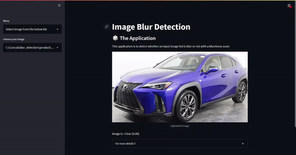

# Image Blur Detection
 This project aims to determine if an image is blurred or not with a blurriness score
 
 **Data:**
20k clear images and 100k blurred images(generated synthetically using input clear images through Simple, Box and Gaussian blur functions)

**Label:** Label '0' as _Clear_ and Label '1' as _Blur_

**Features:** Maximum and Variance values of Laplacian \& Sobel filters

**Methodology:**
1) Read the input image
2) Convert the RGB image to grayscale mode
3) Compute focus measure using different operators like Laplacian, Sobel, etc.
4) If the computed value is less than the threshold, then the image is labeled as Blur 

**Model:**
Of all the trained classification models, I chose Random Forest classifer based on F1 score metric(imbalanced data)

**Deployment:**  I have deployed the application in Streamlit Cloud. You can either select an image to test from the list or upload one of your own
 
 You can play around here:
 https://share.streamlit.io/nikhilgunti/image-blur-detection/main/streamlit.py

